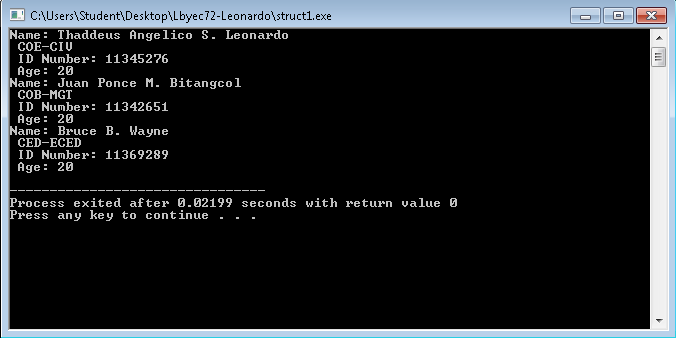

# lbyec72-ej1-struct-thaddeus

#include <stdio.h>
#include <stdlib.h>
#include <string.h>
typedef struct dlsu {
	const char *name;
	const char *college;
	const char *course;
	int idnumber;
	int age;
	struct dlsu *next;
} dlsu;
void display(dlsu *start){
	dlsu *i = start;
	for(;i != NULL; i = i->next){
	printf("Name: %s\n %s-%s\n ID Number: %d\n Age: %d\n", i->name, i->college, i->course, i->idnumber, i->age);
	}
}
int main(){ 
	dlsu student = {"Thaddeus Angelico S. Leonardo", "COE", "CIV", 11345276, 20, NULL};
	dlsu student2 = {"Juan Ponce M. Bitangcol", "COB", "MGT", 11342651, 20, NULL};
	dlsu student3 = {"Bruce B. Wayne", "CED", "ECED", 11369289, 20, NULL};
	student.next = &student2;
	student2.next = &student3;
	display(&student);
	return 0;
}

